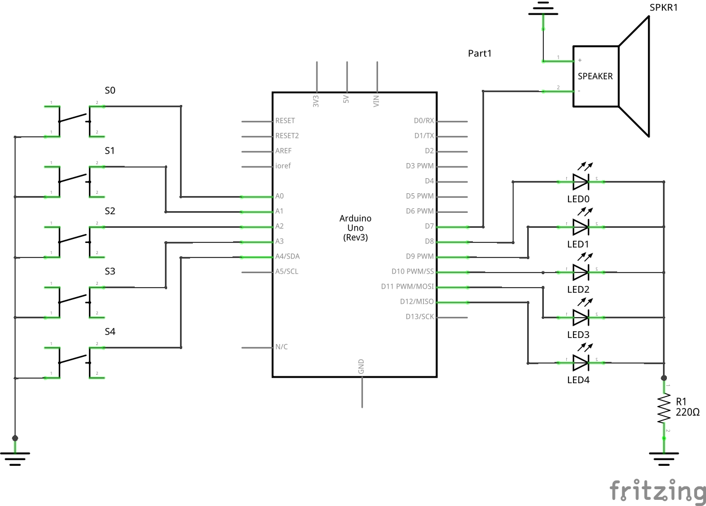
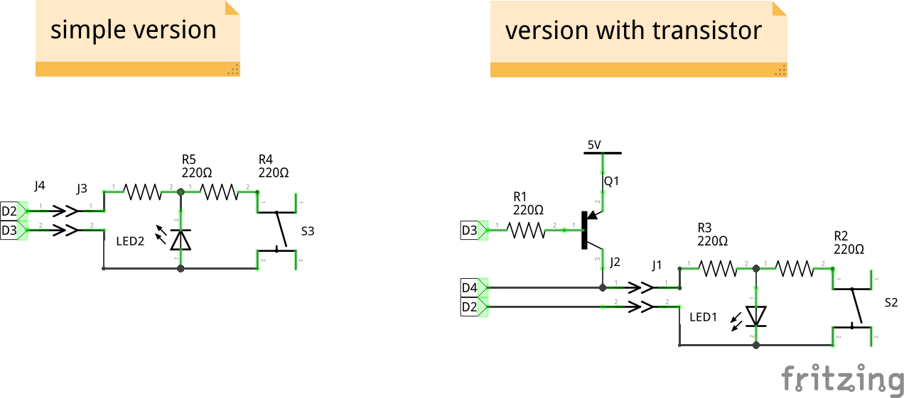

# quizz
Quizz buzzers for arduino

Pour basculer d'un mode à l'autre rester appuyé sur le bouton 0 Plus d'une seconde

## Mode "quizz"
 - Jingle.
 - Attendre un appui sur le 0.
 - Jingle.
 - Allumer 0.
 - Attendre l'appui de 1, 2, 3 ou 4.
 - Le premier appuyé s'allume.
 - Retour au début.

 ## Mode "simon"
  - Jingle.
  - Attendre un appui sur le 0.
  - Jouer N notes (d'abord 1, puis une de plus à chaque tour).
  - Attendre qu'on rejoue les mêmes notes.
    À chaque pression, on attend que le button soit relaché avant de continuer (pour empécher d'en appuyer plusieurs).
    En cas d'erreur, jouer un "buzz" à la place de la note et on recommence.
  - Continuer jusqu'au maximum (limité à 25) et on recommence.

## Cablage
Voici le schéma d'ensemble de cette version du code

## Variante
Comme le but est d'avoir un "bloc" par paire bouton/led, il faut limiter le cablage entre les blocs.

Le code test2wire montre une solution avec 2 fils, mais il reste à généraliser avec plusieurs blocs et adapter le code (qui se complexifie un peu)

